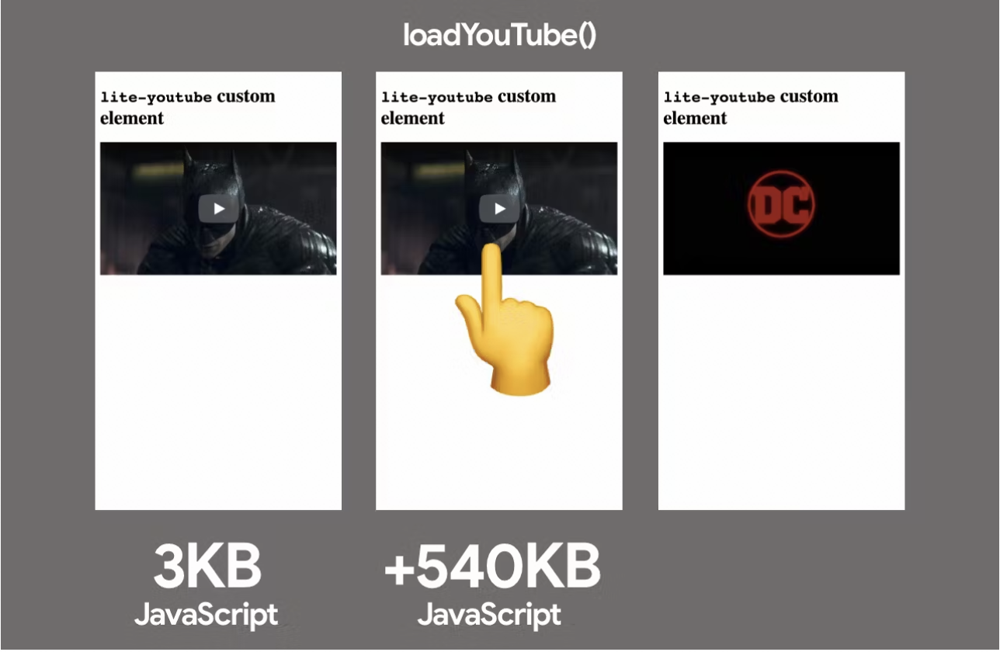
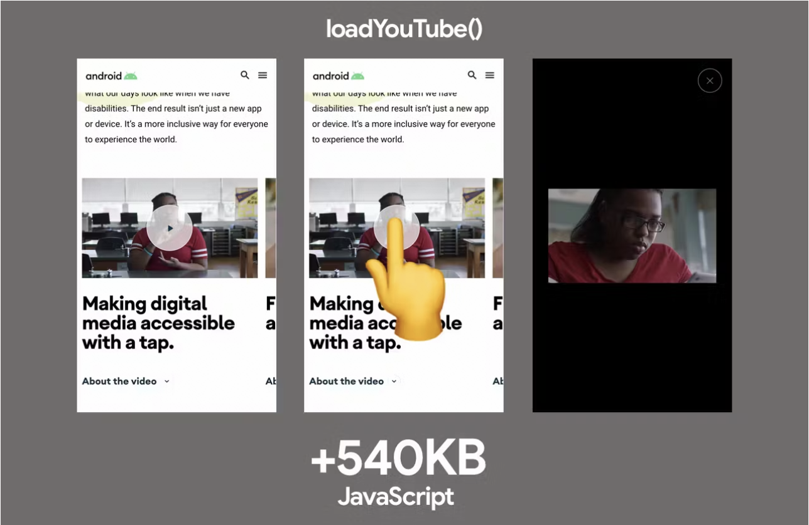
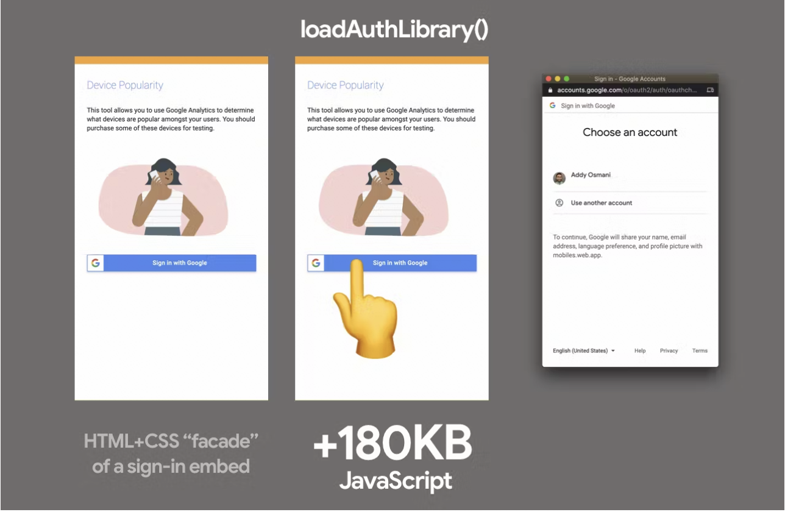
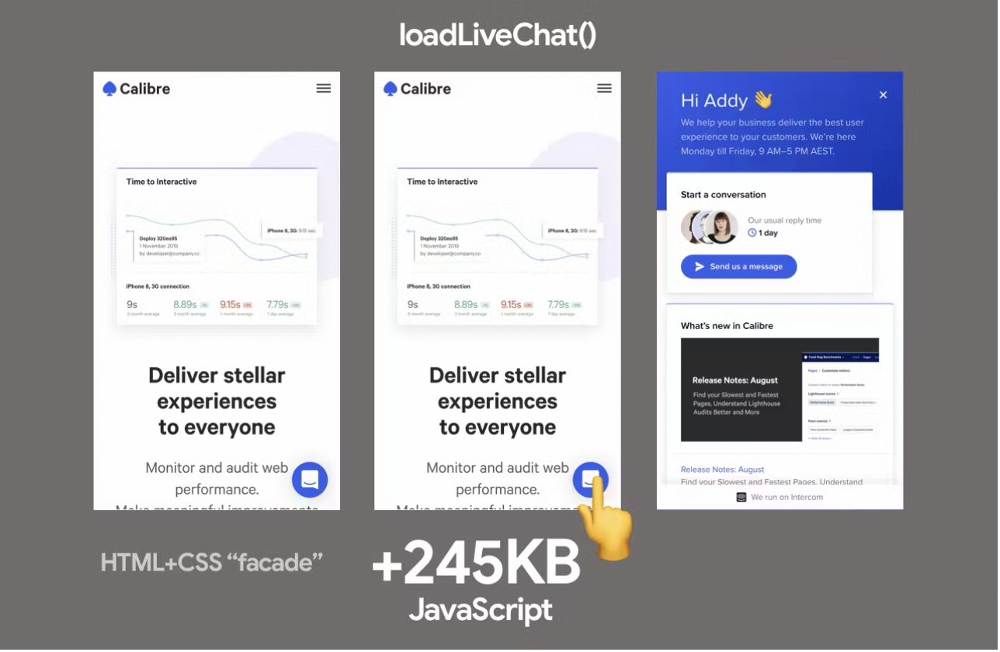
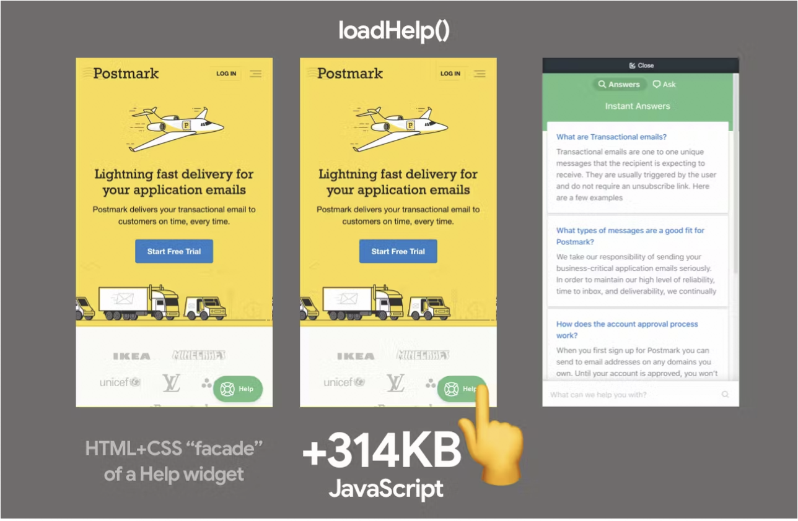

# 交互时导入

当用户与需要它的 UI 交互时，加载非关键资源

```text
简而言之：当用户与需要它的 UI 交互时，延迟加载非关键资源。
```

您的页面可能包含对于某些组件或资源的代码或数据，但这些组件或资源并不是立即必要的。例如，用户界面的一部分，用户只有在单击或滚动页面的某些部分时才能看到。这可以适用于您编写的许多种类的一方代码，但也适用于第三方小部件，例如视频播放器或聊天小部件，您通常需要单击按钮才能显示主要界面。

如果这些资源是昂贵的，急切地加载它们可能会阻塞主线程，推迟用户与页面上更关键部分进行交互的时间。这可能会影响交互准备度指标，例如第一输入延迟、总阻塞时间和交互时间。相反，您可以在更适宜的时刻加载这些资源，例如：

- 当用户首次点击与该组件进行交互时
- 滚动该组件到视图中
- 或者延迟加载该组件，直到浏览器处于空闲状态（通过 requestIdleCallback）

不同的加载资源的方式可以概括为以下几种：

- 急切加载 - 立即加载资源（正常加载脚本的方式）
- 懒加载（基于路由）- 用户导航到路由或组件时加载
- 懒加载（交互时）- 用户单击 UI 时加载（例如，显示聊天）
- 懒加载（在视口中）- 用户向组件滚动时加载
- 预取 - 在需要之前加载，但在关键资源加载之后
- 预加载 - 急切加载，具有更高的紧迫性

```text
首先，对于 first-party 的代码，交互时导入的操作应该仅在若是在交互之前无法预取资源时进行。但是对于第三方代码，这种模式通常非常相关，因为您希望将其延迟到稍后的时间点，如果非关键则不会立即加载。可以通过许多方式来实现这一点（延迟到交互、浏览器处于空闲状态或使用其他启发式算法等）。
```

在本文中，我们将介绍许多场景中使用的延迟导入特性代码的模式。您可能已经在 Google Docs 中使用过这种模式，在那里，他们通过延迟加载分享功能的脚本，节省了 500KB 的脚本加载时间，直到用户进行了交互才会加载。


在加载第三方小部件时，交互时导入也可能非常适合使用。

#

## “伪造”用外观加载第三方 UI

你可能正在导入一个第三方脚本，并且对其渲染或代码何时加载的控制较少。一种实现交互式加载的选项非常直接：使用一个外观。外观是一个简单的“预览”或“占位符”，用于模拟基本体验，例如使用图像或截图。这是我们在 Lighthouse 团队中使用的这个想法的术语。

当用户点击“预览”（外观）时，资源的代码被加载。这限制了用户需要支付功能的体验成本，如果他们不打算使用它。同样，当用户悬停时，外观可以预连接到必要的资源。

```text
第三方资源通常会被添加到页面中，而没有充分考虑它们如何适应整个站点的加载。同步加载的第三方脚本会阻塞浏览器解析器，并可能延迟hydration（即页面交互能力）。如果可能，应使用async/defer（或其他方法）加载第三方脚本，以确保1P脚本不会因网络带宽不足而受阻。除非它们是关键的，否则可以考虑将它们延迟到导入交互中来进行加载。
```

#

## 视频播放器嵌入

一个很好的“facade”（外观）的例子是由 Paul Irish 开发的 YouTube Lite Embed。它提供了一个自定义元素，需要一个 YouTube 视频 ID，并显示一个最小化的缩略图和播放按钮。点击该元素将动态加载完整的 YouTube 嵌入代码，这意味着从未点击播放的用户不需要为获取和处理该代码付出代价。



类似的技术在一些 Google 网站上也得到了应用。在 Android.com 上，不是急切地加载 YouTube 视频播放器嵌入式代码，而是向用户展示一个缩略图和一个伪播放器按钮。当用户单击它时，会弹出一个模态框，使用全功能的 YouTube 视频播放器嵌入式代码自动播放视频：



#

## 认证

应用程序可能需要通过客户端 JavaScript SDK 支持与服务的身份验证。有时这些 SDK 可能很大，JS 执行成本很高，如果用户不打算登录，就不想急切地加载它们。相反，在用户单击“登录”按钮时动态导入身份验证库，以在初始加载期间保持主线程更加自由。



#

## 聊天小部件

Calibre 应用程序通过采用类似的 facade 方法，在其基于 Intercom 的在线聊天功能上提高了 30％的性能。他们使用仅包含 CSS 和 HTML 的“假”快速加载聊天按钮，当用户单击该按钮时，会加载他们的 Intercom 包。



Postmark 注意到他们的 Help 聊天小部件总是被急切地加载，即使它只偶尔被客户使用。该小部件将拉取 314KB 的脚本，比他们整个主页的大小还要大。为了改善用户体验，他们用 HTML 和 CSS 替换了小部件，使用一个虚拟的副本，当用户点击时再加载真正的部件。这个改变将交互时间从 7.7 秒缩短到了 3.7 秒。



#

## 其他

Ne-digital 使用了一个 React 库来实现用户点击“回到顶部”按钮时实现页面的带动画的滚动。他们并不急于在页面加载时立即加载 react-scroll 库，而是在用户点击按钮时进行加载，从而节省了大约 7KB 的资源：

```typescript
handleScrollToTop() {
    import('react-scroll').then(scroll => {
      scroll.animateScroll.scrollToTop({
      })
    })
}
```


#

## 如何进行基于交互的导入呢？

### 原生 JS

在 JavaScript 中，使用 dynamic import() 可以实现惰性加载模块并返回一个 Promise，在正确的场景下非常强大。下面是一个示例，在按钮事件监听器中使用 dynamic import 导入 lodash.sortby 模块并使用它。

```typescript
const btn = document.querySelector('button');

btn.addEventListener('click', (e) => {
  e.preventDefault();
  import('lodash.sortby')
    .then((module) => module.default)
    .then(sortInput()) // use the imported dependency
    .catch((err) => {
      console.log(err);
    });
});
```

在动态导入不可用或不适用的情况下，也可以使用基于 Promise 的脚本加载器动态将脚本注入页面（查看此处的完整实现，它演示了一个登录界面）：

```javascript
const loginBtn = document.querySelector('#login');

loginBtn.addEventListener('click', () => {
  const loader = new scriptLoader();
  loader
    .load(['//apis.google.com/js/client:platform.js?onload=showLoginScreen'])
    .then(({ length }) => {
      console.log(`${length} scripts loaded!`);
    });
});
```

#

## React

让我们想象一下我们有一个聊天应用程序，它有一个`<MessageList>`、`<MessageInput>`和一个`<EmojiPicker>`组件（由 emoji-mart 提供支持，它的大小为 98KB，经过压缩和最小化）。通常情况下，我们会在初始页面加载时急切地加载所有这些组件。

```javascript
import MessageList from './MessageList';
import MessageInput from './MessageInput';
import EmojiPicker from './EmojiPicker';

const Channel = () => {
  ...
  return (
    <div>
      <MessageList />
      <MessageInput />
      {emojiPickerOpen && <EmojiPicker />}
    </div>
  );
};
```


使用代码分割（code-splitting）来分解这个工作相对来说是比较简单的。React.lazy 方法使得在组件级别上进行代码分割变得很容易，只需要使用动态导入即可。React.lazy 函数提供了一种内置的方式来将应用程序中的组件分成单独的 JavaScript 代码块，几乎不需要额外的工作。你可以通过和 Suspense 组件一起使用来处理加载状态。

```typescript
import React, { lazy, Suspense } from 'react';
import MessageList from './MessageList';
import MessageInput from './MessageInput';

const EmojiPicker = lazy(
  () => import('./EmojiPicker')
);

const Channel = () => {
  ...
  return (
    <div>
      <MessageList />
      <MessageInput />
      {emojiPickerOpen && (
        <Suspense fallback={<div>Loading...</div>}>
          <EmojiPicker />
        </Suspense>
      )}
    </div>
  );
};
```

我们可以将这个想法扩展到仅在点击 `<MessageInput>` 中的表情符号图标时才导入 Emoji Picker 组件的代码，而不是在应用程序最初加载时急切地加载它:

```typescript
import React, { useState, createElement } from 'react';
import MessageList from './MessageList';
import MessageInput from './MessageInput';
import ErrorBoundary from './ErrorBoundary';

const Channel = () => {
  const [emojiPickerEl, setEmojiPickerEl] = useState(null);

  const openEmojiPicker = () => {
    import(/* webpackChunkName: "emoji-picker" */ './EmojiPicker')
      .then((module) => module.default)
      .then((emojiPicker) => {
        setEmojiPickerEl(createElement(emojiPicker));
      });
  };

  const closeEmojiPickerHandler = () => {
    setEmojiPickerEl(null);
  };

  return (
    <ErrorBoundary>
      <div>
        <MessageList />
        <MessageInput onClick={openEmojiPicker} />
        {emojiPickerEl}
      </div>
    </ErrorBoundary>
  );
};
```


#

## Vue

在 Vue.js 中，可以通过几种不同的方式实现类似的按需导入模式。其中一种方法是使用动态导入包装在函数中，即`() => import("./Emojipicker")`，动态导入 `Emojipicker` Vue 组件。通常情况下，当需要呈现组件时，Vue.js 会对其进行懒加载。

然后，我们可以在用户交互后对懒加载进行限制。通过在点击按钮时切换在选择器父 `div` 上的条件性 `v-if`，我们可以在用户点击时有条件地获取和渲染 `Emojipicker` 组件。

```javascript
<template>
  <div>
    <button @click="show = true">Load Emoji Picker</button>
    <div v-if="show">
      <emojipicker></emojipicker>
    </div>
  </div>
</template>

<script>
export default {
  data: () => ({ show: false }),
  components: {
    Emojipicker: () => import('./Emojipicker'),
  },
};
</script>
```

“按需加载”模式应该适用于支持动态组件加载的大多数框架和库，包括 Angular。

#

## 导入互动作为渐进式加载的第一方代码

加载代码的交互式方法也是 Google 处理渐进式加载在大型应用程序（如 Flights 和 Photos）中的关键部分。为了说明这一点，让我们看一下 Shubhie Panicker 曾经提出的一个例子。

假设用户正在计划前往印度孟买的旅行，并访问 Google 酒店查看价格。所有为此交互所需的资源都可以提前急切地加载，但是如果用户没有选择任何目的地，那么地图所需的 HTML/CSS/JS 就是不必要的。


在最简单的下载场景中，假设 Google 酒店使用简单客户端渲染（CSR）。所有代码都会预先下载和处理：首先是 HTML，然后是 JS、CSS，然后获取数据，只有在我们拥有所有内容后才进行渲染。然而，这会让用户等待很长时间，屏幕上没有显示任何内容。一大部分 JavaScript 和 CSS 可能是不必要的。


接下来，想象一下这种体验转移到服务器端渲染（SSR）。这将使用户更早地获得一个视觉上完整的页面，这很好，但在从服务器获取数据并完成客户端框架的 hydration 之前，页面将无法交互。


SSR 可以提升用户体验，但用户可能会有一种奇怪的感觉，页面看起来已经准备好了，但他们无法点击任何东西。有时这被称为“怒点”，因为用户会因沮丧而一遍又一遍地点击。

在 Google Hotels 搜索示例中，如果我们放大 UI 界面，我们可以看到当用户点击“更多过滤器”以找到最合适的酒店时，所需的组件代码会被下载。

$$初始阶段只下载了极少量的代码，接下来用户交互会决定哪些代码会被下载。$$

让我们更仔细地看看这种加载方案。


交互驱动的迟加载有几个重要方面：

- 首先，我们最初下载了最少量的代码，以便页面能够迅速地视觉完成。

- 其次，当用户开始与页面交互时，我们使用这些交互来确定需要加载哪些其他代码，例如加载“更多筛选”组件的代码。

- 这意味着许多页面功能的代码永远不会被发送到浏览器，因为用户不需要使用它们。


## 如何避免丢失早期点击？

在这些 Google 团队使用的框架栈中，我们可以在框架启动前的第一块 HTML 中包含一个小型事件库 (JSAction)，该库可以跟踪所有点击。这些事件用于两个目的：

- 基于用户交互触发组件代码的下载
- 当框架启动完成后，回放用户交互

其他潜在的启发式方法包括：

- 空闲时间后的一段时间内
- 在用户悬停在相关的 UI/按钮/行动调用上时
- 基于浏览器信号 (如网络速度、数据保存模式等) 的渴望程度的滑动比例加载组件代码。


## 这样做对于数据该如何处理呢？

用于渲染页面的初始数据包含在初始页面的 SSR HTML 中并进行流式传输。根据用户的交互加载迟到的数据。我们知道哪些组件需要哪些数据，因此可以下载相应的数据。

这样完成了导入 - 按交互方式的情况，其中数据获取与 CSS 和 JS 类似。由于组件知道它需要什么代码和数据，因此其所有资源从不超过一个请求。


这个过程的实现是通过在构建期间创建组件和它们的依赖图。Web 应用程序可以在任何时候引用这个图表，并快速获取任何组件所需的资源（代码和数据）。这也意味着我们基于组件而不是路由进行代码分割。

有关上述示例的详细步骤，请参见“[以 JavaScript 社区为中心推进 Web 平台](https://www.youtube.com/watch?v=-xZHWK-vHbQ)”。

#

## Trade-offs

将昂贵的工作转移到用户交互的更近处可以优化页面初始加载的速度，但这种技术并非没有折衷之处。

### 如果用户点击后需要很长时间才能加载脚本会发生什么？

在 Google Hotels 的例子中，小而精细的代码块最大程度地减小了用户等待代码和数据获取和执行的时间的可能性。在其他一些情况下，一个大的依赖关系可能会引入这个问题，特别是在较慢的网络中。

减少这种情况发生的方法之一是更好地分解或在关键内容加载完成后预取这些资源。我鼓励对这种影响进行度量，以确定在您的应用程序中它有多大的作用。

### 那么在用户交互之前缺乏功能怎么办？

facade（包装器）的另一个折衷是在用户交互之前缺乏功能。例如，嵌入式视频播放器将无法自动播放媒体。如果这种功能很关键，你可能需要考虑替代的资源加载方法，比如当用户滚动它们到视图中时，延迟加载这些第三方 iframe，而不是将它们的加载推迟到交互之后。

#

## 将交互式嵌入替换为静态版本

我们已经讨论了按需加载模式和渐进式加载，但是完全静态化嵌入使用情况呢？

在某些情况下，可能需要立即使用嵌入式内容，例如在初始视口中可见的社交媒体帖子。当嵌入式内容引入了 2-3MB 的 JavaScript 时，这也会带来自己的挑战。因为嵌入式内容需要立即使用，所以懒加载和门面可能不太适用。

如果要优化性能，可以完全用类似的静态版本替换嵌入，链接到更交互式的版本（例如原始的社交媒体帖子）。在构建时，可以提取嵌入数据并将其转换为静态 HTML 版本。


这是@wongmjane 在她的博客中为一种社交媒体嵌入式实现的方法，它可以改善页面加载性能，并消除由于嵌入式代码增强备用文本而引起的累积布局移位。

虽然静态替代品对性能有好处，但它们通常需要定制，因此在评估选项时请记住这一点。

#

## 结论

first party JavaScript 经常影响现代 Web 页面的交互就绪性，但它经常被网络上的来自 first party 或第三方源的非关键 JS 所延迟，从而使主线程繁忙。

通常应该避免在文档头部使用同步的第三方脚本，并且在 first party JS 加载完成后，应该努力加载非阻塞的第三方脚本。像基于交互的导入这样的模式为我们提供了一种推迟加载非关键资源的方法，直到用户更有可能需要它们支持的 UI。

_特别感谢 Shubhie Panicker、Connor Clark、Patrick Hulce、Anton Karlovskiy 和 Adam Raine 提供的帮助。_
