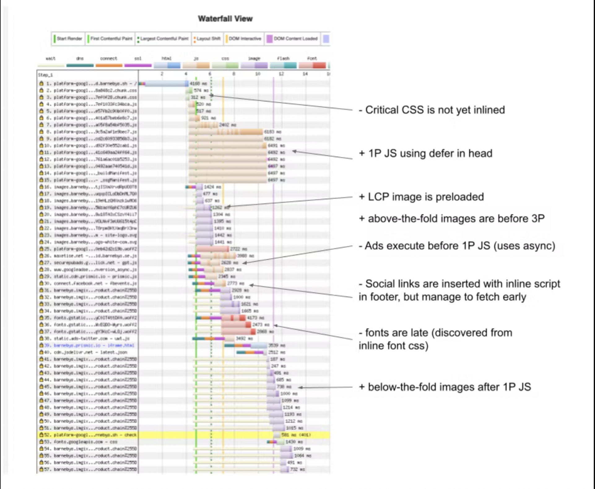

# 优化加载顺序

学习如何优化加载顺序来提高应用的快速可用性

注：本文极大受来自于 chrome 的 Aurora 团队的灵感启发，尤其是一直以来研究优化加载顺序的 Shubhie Panicker 的影响。

每一个成功的网页加载，一些重要的组件和资源在正确的时机变得可用会带给人一个顺畅的加载体验。这确保了用户感受到应用的性能表现是非常棒的。这种极棒的用户体验通常也会转化成传递[网站关键指标 CWV](https://web.dev/vitals/)。

重要的指标，例如首次内容呈现（First Content Paint）、最大内容呈现（Largest Contentful Paint）、首次输入延迟（First Input Delay）等，用于衡量性能，直接取决于关键资源的加载顺序。例如，如果关键资源（如 hero image[[1]](#references)）未加载，则页面无法拥有其 LCP。本文探讨了资源加载顺序与网页指标之间的关系。我们的目标是提供清晰的指导，以优化加载顺序，以改善网页指标。

在我们建立理想的加载顺序之前，让我们先尝试理解为什么很难正确地确定加载顺序。

## 为何最优加载顺序很难实现？

我们有独特的机会为许多合作伙伴的网站进行性能分析。我们发现，在不同的合作伙伴网站中，存在多个类似的问题，影响了页面的高效加载。

开发人员的期望与浏览器在页面上优先处理资源的方式之间经常存在重大差异，这经常导致性能得分低效。我们进一步分析，以发现是什么导致了这种差距，以下几点总结了我们分析的要点。

### 低效的顺序

优化 Web Vitals 不仅需要对每个指标的含义有很好的理解，还需要知道它们发生的顺序以及它们与不同关键资源的关系。FCP 在 LCP 之前发生，而 LCP 在 FID 之前发生。因此，为了实现 FCP，必须优先处理实现 FCP 所需的资源，然后是实现 LCP 所需的资源，最后是实现 FID 所需的资源。

资源经常没有按正确的顺序进行排序和处理。这可能是因为开发人员不知道指标对资源的加载有依赖性。因此，相关资源有时不会在相应的指标触发时准时可用。

#### 例子 🌰

- 当 FCP 触发的时候，hero image 应该已经可以用于触发 LCP 了。
- 当 LCP 触发的时候，JS 应该已经被下载、解析和准备就绪（或者已经在执行）去不阻塞交互（FID）了。

### 网络/CPU 利用率

资源也没有适当的流水线去确保充分的利用 CPU 和网络。当进程被网络限制的时候，这会导致 CPU 出现“死区时间”，反之亦然。

一个很好的例子 🌰 就是可能被并行或者顺序下载的脚本。由于带宽在并发下载期间被划分，对于并行和顺序下载，整体的下载所有脚本的时间是一样的。如果并行下载脚本，CPU 在下载期间就未得到充分利用。然而，如果按顺序下载脚本，CPU 可以在下载第一个脚本后立即开始处理。这会达到更好的 CPU 和网络利用率。

### 第三方（3P）产品

常常需要第三方库来给网站增加通用的特性和功能。第三方库如广告、分析、社交部件、实时聊天和其他为网站提供支持的嵌入。一个第三方库会携带自己的 JS、图片和字体等等。

第三方产品通常没有动力去优化和支持消费方网站的加载性能。他们可能会有一个很沉重的 JS 执行花销，导致延迟交互性或者妨碍其他重要资源的下载。

开发人员包括第三方产品可能倾向于更多的关注他们在功能方面增加的价值，而不是性能影响。因此，第三方资源有时候会被随意的添加，而不会从如何加入到整体的加载顺序的角度来充分的考虑。这就会使得它们难以控制和安排。

### 平台怪癖（Platform Quirks）

不同的浏览器在优先处理请求和实现提示方面可能存在差异。如果你对平台及其特性有深入的了解，优化会更容易。特定于特定浏览器的行为会使得难以实现所需的加载顺序的一致性。

其中一个例子是 Chromium 平台上的预加载错误。预加载指令(<link rel=preload>)可用于告诉浏览器尽快下载关键资源。仅当您确定资源将在当前页面上使用时才应使用它。Chromium 中的错误导致它的行为如此，即通过<link rel=preload>发出的请求始终比预加载扫描器看到的其他请求优先开始，即使这些请求具有更高的优先级。这样的问题会破坏优化计划。

### HTTP2 优先级（HTTP2 Prioritization）

协议本身并没有提供太多选项或旋钮来调整资源的顺序和优先级。即使更好的优先级基元可用，HTTP2 优先级仍存在一些潜在问题，使得最佳排序变得困难。主要是，我们无法预测服务器或 CDN 将如何按个别资源的请求进行优先级排序。一些 CDN 会重新安排请求，而另一些则实施部分、有缺陷或没有优先级排序。

### 资源等级优化（Resource level optimization）

有效的排序需要被排序的资源得到最佳服务，以便它们可以快速加载。关键的 CSS 应该内联，图片应该正确调整大小，JavaScript 应该进行代码拆分，并以增量方式进行交付。

框架本身缺乏允许代码拆分并以增量方式服务 JS 和数据的结构。用户必须依靠以下其中之一来拆分大块的 1P JS：

- Modern React（Suspense / Concurrent mode / Data Fetching） - 这仅供实验之用。
- 使用动态导入进行延迟加载 - 这不直观，开发人员需要手动识别代码拆分的边界。

在代码拆分时，开发人员需要实现适当的代码粒度，因为代码粒度和性能之间存在权衡。

更高的粒度是可取的，因为它可以：

- 将个别路由所需的 JS 最小化，并在随后的用户交互中使用。
  允许常见依赖项的缓存。这确保库的更改不需要重新获取整个包。
- 与此同时，代码拆分的过度细化也可能不好，因为过多的小块会降低每个块的压缩率并影响浏览器性能。

资源优化还需要消除死代码或未使用的代码。不必要或过时的 JS 通常会发送到现代浏览器中，这会对性能产生负面影响。将 JS 转译为 ES5 并捆绑使用 polyfill 对于现代浏览器来说是不必要的。库和 npm 包通常未以 ES 模块格式发布，这使得打包程序难以进行摇树和优化。

正如您可能已经注意到的那样，这些问题不限于特定的资源或平台。为了解决这些问题，需要了解整个技术栈以及如何合并不同的资源以实现最佳指标。在定义整体优化策略之前，让我们看看如何通过满足各个资源的要求来实现我们的目的。

## 更多资源信息 - 关系、约束和优先级（Relations, Constraints, and Priorities）

在前面的部分中，我们举了一些示例，说明某些资源对于特定事件（例如 FCP 或 LCP）的触发是必要的。在我们讨论如何处理它们之前，让我们先了解所有这些依赖关系。以下是一个按资源列出的建议、约束和需要注意的问题清单，这些都需要在定义理想的资源加载顺序之前考虑到。

### 关键 CSS（Critical CSS）

关键 CSS 指的是 FCP 所需的最小 CSS。最好将这种 CSS 嵌入到 HTML 中，而不是从另一个 CSS 文件中导入。在任何给定时间，只需下载该路由所需的 CSS，而所有关键 CSS 应相应地拆分。

如果无法内联 CSS，则应预加载关键 CSS 并从与文档相同的来源提供。避免从多个域名提供关键 CSS，或直接使用第三方关键 CSS（如 Google Fonts）。你自己的服务器可以代理第三方关键 CSS。

延迟获取 CSS 或获取 CSS 的顺序不正确可能会影响 FCP 和 LCP。为避免这种情况，非内联 CSS 应在网络上优先考虑并排在 1P JS 和 ATF 图像之上。

过多的内联 CSS 可导致 HTML 膨胀和主线程长时间样式解析。这可能会影响 FCP。因此，确定关键内容并进行代码拆分至关重要。

内联的 CSS 无法缓存。解决此问题的一个方法是，对该 CSS 进行重复请求并对其进行缓存。但请注意，这可能导致多个全页布局，可能会影响 FID。

### 字体

与关键 CSS 一样，关键字体的 CSS 也应内联。如果无法内联，脚本应加载时指定 preconnect。延迟获取字体，例如来自 Google Fonts 或不同域的字体，可能会影响 FCP。preconnect 告诉浏览器提前设置到这些资源的连接。

内联字体可能会显著增加 HTML 的体积，并延迟启动其他关键资源的获取。字体回退可以用于解除 FCP 阻塞并使文本可用。但是，使用字体回退会影响 CLS，因为会导致跳字。它也可能会影响 FID，因为真正的字体到达时，主线程可能会有一个潜在的大型样式和布局任务。

### 首屏图像（Above the Fold (ATF) Images）

这指的是最初在页面加载时对用户可见的图片，因为它们在视口内。ATF 图片的一个特殊情况是页面的主要图片。所有 ATF 图片都应该被调整大小。未调整大小的图片会影响 CLS 指标，因为它们完全呈现时会出现布局移位。ATF 图片的占位符应该由服务器呈现。

延迟的 hero images 或空白占位符会导致 LCP 延迟。此外，如果占位符的大小与实际主要图片的内在大小不匹配，并且图像没有被替换叠加，那么 LCP 会重新触发。理想情况下，ATF 图片不应对 FCP 产生影响，但在实践中，图片可能会触发 FCP。

### 不可视图像（Below the Fold (BTF) Images）

这些图片在页面加载时不会立即对用户可见。因此，它们是懒加载的理想选择。这可以确保它们不会与页面上所需的 1P JS 或重要的 3P 资源发生竞争。如果在 1P JS 或重要的 3P 资源之前加载 BTF 图片，FID 将会延迟。

### 1P JavaScript

1P JavaScript 影响应用程序的交互就绪性。它可能会因为图片和第三方 JS 而在网络上被延迟，也可能会在主线程上被第三方 JS 阻塞。因此，它应该在网络上的 ATF 图片之前开始加载，并在主线程上在第三方 JS 之前执行。在服务器端呈现的页面中，1P JavaScript 不会阻止 FCP 和 LCP。

### 3P JavaScript

HTML 头部的 3P 同步脚本可能会阻止 CSS 和字体解析，因此会影响 FCP。头部同步脚本还会阻止 HTML body 解析。在主线程上执行的第三方脚本可能会延迟 1P 脚本的执行，并推迟 hydration 和 FID。因此，需要更好的控制加载第三方脚本。

这些建议和限制通常适用于各种技术堆栈和浏览器。请注意，有时建议也会成为限制。例如，内联字体和 CSS 非常好，但太多会导致页面过于臃肿。关键是要找到“太少太迟”和“太多太快”的平衡点。

下面的图表为我们提供了 Chrome 加载不同资源的优先级的理解。将优先级信息和资源类型的讨论结合起来，有助于更好地理解下一节中提出的加载顺序。

以下是此表格的主要要点：

- CSS 和字体具有最高的优先级。这应该有助于我们优先考虑关键的 CSS 和字体。
- 脚本的优先级取决于它们在文档中的位置以及它们是否是异步、延迟或阻塞的。在第一张图片（或文档中的早期图片）之前请求的阻塞脚本比在第一张图片获取后请求的阻塞脚本具有更高的优先级。无论脚本在文档中的位置如何，异步/延迟/注入的脚本优先级最低。因此，我们可以使用适当的属性来异步和延迟不同的脚本，从而优化脚本的优先级。
- 在视口中可见的图像具有更高的优先级（Net: Medium），而不在视口中的图像具有较低的优先级（Net: Lowest）。这有助于我们将重点放在 ATF 图片上，而不是 BTF 图片上。

现在让我们看看如何将上述所有细节组合起来定义一个最佳的加载顺序。

## 什么是理性的加载顺序

有了这些背景知识，我们现在可以提出一个加载顺序，旨在优化 1P 和 3P 资源的加载。所提出的顺序以 Next.js 服务器端渲染（SSR）为参考进行优化。

## 当前状态

根据我们的经验，以下是未经过优化的 Next.js SSR 应用程序的典型加载顺序。

| CSS        | CSS 应在 JS 之前进行预加载，但不应内联。使用 preconnect 进行预连接。                                  |
| ---------- | ----------------------------------------------------------------------------------------------------- |
| JavaScript | 1P JS 应进行预加载，3P JS 不应管理。                                                                  |
| Fonts      | 字体应使用 preconnect 进行预连接，以减少字体加载时间。建议将字体内联，以避免外部 CSS 文件加载的延迟。 |
| Images     | Hero images 和 ATF images 应优先加载和优化。                                                          |

以下是我们合作伙伴网站中的一个示例序列。包括有关加载序列的优点和缺点的注释。

## 没有第三方资源(3P)的建议加载顺序

下面是一个考虑到之前讨论的所有限制的加载顺序。让我们先处理一个不包含第三方资源的顺序，然后再看看如何在此顺序中交错使用第三方资源。请注意，我们在此处将 Google Fonts 视为 1P 资源。

> 表格见[原文](https://www.patterns.dev/posts/loading-sequence)，此处略

虽然这个顺序的某些部分可能很直观，但以下几点可以进一步证明它的合理性：

我们建议尽可能避免使用预加载，因为它强制要求对每个前置资源进行手动预加载，还会导致手动排序。应特别避免对字体进行预加载，因为很难检测到关键字体。
字体 CSS 应该理想地内联。来自另一个源的字体应该使用 preconnect 进行获取。
推荐对来自另一个源的所有资源使用 preconnect。这将确保提前建立连接以下载这些资源。
在用户交互开始之前（FID），应先获取非关键 CSS。这将避免由于后续呈现此类 CSS 导致的样式问题。
在网络上的 ATF 图像之前开始获取第一方 JS。它需要一些时间来下载和解析 JS。
在解析 1P JS 的同时，可以在主线程上继续解析 HTML 和下载 ATF 图像。

## 有第三方资源(3P)的建议加载顺序

最终，我们已经达到了一个可以为现代 Web 应用程序中常见的所有关键资源提出序列的阶段。以下是在考虑第三方资源的情况下，主浏览器线程和网络抓取请求的事件序列：

> 表格见[原文](https://www.patterns.dev/posts/loading-sequence)，此处略

主要问题在于如何确保 3P 脚本以最优的方式下载并按照所需的顺序加载。

由于脚本请求会发送到另一个域，因此建议为以下 3P 请求使用预连接（preconnect）。这有助于优化下载。

#1 - FCP 阻塞 3P 资源
#5 - 需要用于 LCP 的个性化 3P ATF 图像
#9 - 必须在用户首次交互之前执行的 3P
#12 - 默认 3P JS

为了实现所需的顺序，我们建议使用 Next.js 的 ScriptLoader 组件。该组件旨在“优化关键渲染路径并确保外部脚本不会成为最佳页面加载的瓶颈”。其中最相关的功能是加载优先级。这使我们能够在不同的里程碑上安排脚本，以支持不同的用例。以下是可用的加载优先级值：

After-Interactive：在下一次重新渲染后加载特定的 3P 脚本。这可用于加载我们希望尽早执行但在 1P 脚本之后执行的标签管理器、广告或分析脚本。

Before-Interactive：在重新渲染之前加载特定的 3P 脚本。它可用于我们希望在 1P 脚本之前执行 3P 脚本的情况。例如，polyfill.io、机器人检测、安全和身份验证、用户同意管理（GDPR）等。

Lazy-Onload：将所有其他资源优先于指定的 3P 脚本，并延迟加载脚本。它可用于像 Google 反馈或专门用于共享按钮、评论等的社交网络特定脚本的 CRM 组件。

因此，预连接、脚本属性和 Next.js 的 ScriptLoader 组件可以共同帮助我们获得所有脚本的所需顺序。

## 结论

优化应用的责任落在平台创建者和使用者的开发人员肩上。常见的问题需要得到解决。我们的目标是从内部向外部使序列化更加容易。对于不同的使用情况和方案，经过验证的一组推荐措施以及 Script Loader 等工具可以帮助实现 React-Next.js 堆栈的优化。下一步是确保新应用符合以上推荐。

特别感谢 Leena Sohoni（技术分析师/作者）为本文做出的所有贡献。

## References

[1] hero image 通常指网页中用于吸引用户注意力和展示品牌形象的大型、突出的图片或图像。通常这些图片会放置在网页的顶部，通常是全屏或者横跨整个屏幕宽度。这些图片通常是高质量的，具有吸引人的外观和视觉效果，因此它们的加载速度和加载顺序对于提高用户体验和网站性能至关重要。
