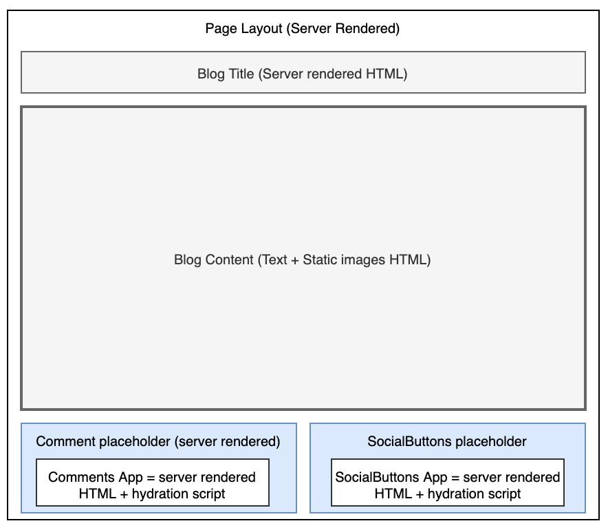
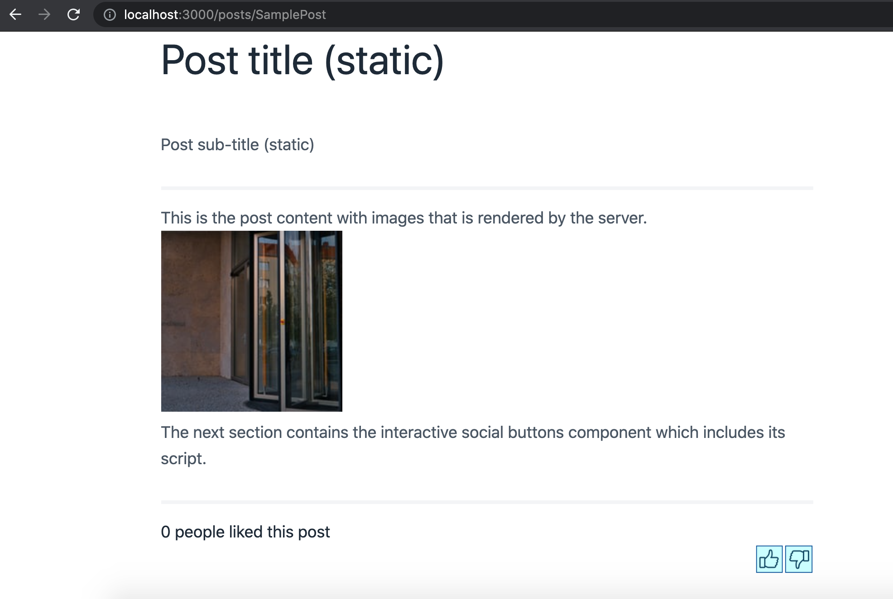
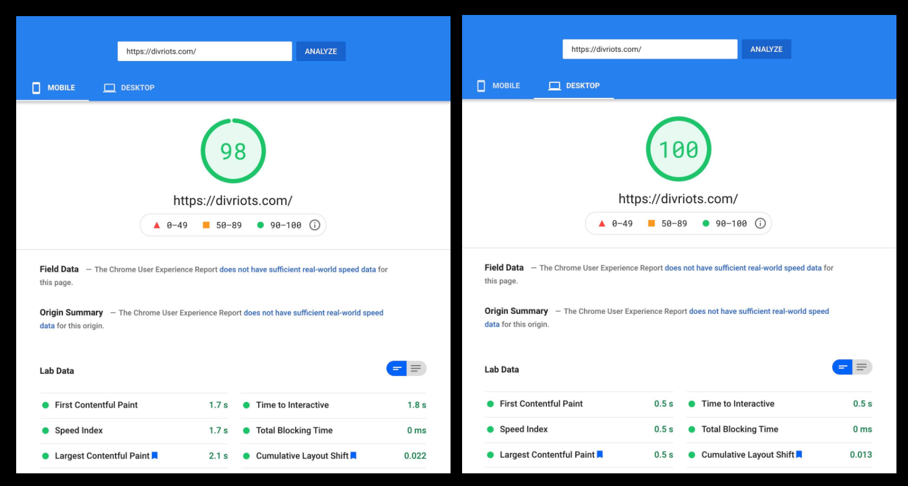

# 孤岛架构

孤岛架构鼓励在 SSR 渲染的网页中构建小而功能专注的交互体验

总结：孤岛架构鼓励在 SSR 渲染的网页中构建小而功能专注的交互体验。孤岛的输出是渐进式的加强 HTML，尤其关于这种加强是如何发生的更加有明确性。相比控制某一应用的整个页面渲染，有多个入口点。在允许页面的其余部分为静态页面的情况下，这些可交互岛的脚本可以被单独传输和水合。

JS 的加载和处理执行会影响性能。然而，即使是在静态内容主导的页面也常常需要一定程度的可交互性和 JS。我们已经讨论了帮助你构建应用的静态渲染的变体以便能找出以下两点之间平衡：

1. 对比 CSR 客户端渲染的可交互性
2. 和 SSR 相比的 SEO 友好性

SSR 的核心原则是 HTML 在服务器渲染后和再水合必要的 JS 脚本一起被传输到客户端。再水合是在服务端渲染后重新在客户端生成 UI 组件的状态。自从再水合会产生一定损耗，每一个 SSR 渲染的变体都试着去优化再水合过程。这主要通过对关键组件的部分水合或者在渲染时对组件流化实现。然而上述技术最终传输的网络部分 JS 还是一样的。

孤岛架构一词被 Katie Sylor-Miller 和 Jason Miller 发扬光大，用来描述一种旨在通过可以在其他静态 HTML 之上被独立传输的可交互性岛来减少 JS 传输量。孤岛是一种基于组件的架构用静态和动态孤岛来表示整个页面的分隔的视图。页面的静态区域是纯不可交互的 HTML，并不需要水合。动态区域则是渲染之后 HTML 和再水合脚本的组合。


让我们更加详细的来讨论下目前基于不同选项实现的孤岛架构。

## 动态组件的孤岛

大多数网页是动态和静态内容的结合体。通常，一个网页是有静态内容和零星的可被隔离的可交互区域组成。例如：

1. 博客帖子、新闻文章以及机构主页包含了图文和可交互部件如嵌入的社交媒体和聊天。
2. 电商网站的商品页面包含了静态商品描述和跳转到应用的其他页面的链接。网页其他区域还有可交互组件如走马灯图片和搜索。
3. 一个典型的银行账号详情网页包含了带了一定程度可互动的筛选功能的一连串的静态交易记录。

静态内容是无状态的，不需要触发事件，也不需要在渲染后再水合。页面渲染后，动态内容（按钮、筛选、搜索栏）必须重新连接到对应的事件。DOM 必须在客户端（虚拟 DOM）上重新被生成。这些再生成、再水合和事件处理函数组成了要被传输到客户端的 JS 脚本。

孤岛架构有助于呈现所有静态内容的 SSR 渲染页面。然而，这个时候，渲染的 HTML 会包含动态就内容的占位符。动态内容占位符包含了独立的组件部件。每一个小部件类似于一个小应用，组成了服务端渲染的输出和用来在客户端水合的 JS 脚本。

在渐进式水合的过程中，网页水合的架构是自顶而下的。网页控制了单个组件的调度和水合。孤岛架构中的每个组件有其对应的异步执行且和网页中其他脚本相互独立的水合脚本。一个组件的性能问题不会影响其他组件。



## 实现孤岛

孤岛架构从不同来源借鉴的理念，目标以最优方式去组合他们。基于模版的静态网页生成器如[Jekyll](https://jekyllrb.com/)和[Hugo](https://gohugo.io/)支持将静态组件渲染到网页上。大多数现代 JS 框架也支持允许使用一套代码同时在服务端和客户端渲染元素的同构渲染（isomorphic rendering）。

Shopify 的工程师[Jason Miller](https://github.com/developit)关于孤岛架构的博文解释了使用 requestIdleCallback()来实现一个用于水合组件的调度方式。静态同构渲染和组件级别的部分水合调度能够内嵌到一个框架中来支持孤岛架构。因此，这个架构需要

1. 支持在服务端 0KB JS 网页的静态渲染
2. 支持在静态内容中通过占位符嵌入独立的动态组件。每一个动态组件包含其对应脚本，并且只要主线程一空闲就能用 requestIdleCallback()来水合自身。
3. 允许在客户端水合对服务端上的组件进行同构渲染以识别两端的同一组件。

你可以使用下面讨论的现成选项之一来实现这一点。

## 框架

现如今，不同的框架都能支持孤岛架构。其中值得一提的是：

1. Marko：[Marko](https://markojs.com/)是 eBay 的一个开源框架，用来提高服务端渲染性能。它通过组合带自动部分水合的流化渲染来支持孤岛架构。HTML 和其他静态资源只要准备好了就会马上被流式传输到客户端。自动化部分水合允许可交互组件去水合自身。水合代码只为了可交互组件才被传输，用来改变他们在浏览器中的状态。Marko 是同构的，且其编译器会根据代码是在服务端或者客户端执行来生成优化过的代码。

2. Astro：[Build](https://astro.build/)是一个静态网站构建器，用来生成由其他框架如 React、Preact、Svelte、Vue 等等构建 UI 组件的轻量的静态 HTML 页面。需要客户端侧 JS 的组件带着各自的依赖一起被分别加载。因此，Astro 提供内嵌的部分水合。Astro 也能根据是否可见懒加载组件。我们也在下一部分提供了一个使用 Astro 的例子。

3. Eleventy + Preact：[Markus Oberlehner](https://markus.oberlehner.net/blog/building-partially-hydrated-progressively-enhanced-static-websites-with-isomorphic-preact-and-eleventy/#lazy-hydration)阐释了 Eleventy 的使用案例：一个使用能部分水合的同构 Preact 组件的静态网站生成器。Eleventy 也支持懒水合。组件本身声明式地控制组件水合。可交互组件使用一个名为`WithHydration`的包裹以便他们能在客户端被水合。

注意 Marko 和 Eleventy 虽然是早于 Jason 提供孤岛定义的时候但是依然包含了部分必需的功能来支持它。然而，Astro 则是基于孤岛的定义所创建，并且从底层支持了孤岛架构。在接下来的内容里，我们会阐述一个前面提到的用 Astro 构建的简单博客网页。

## 实现示例

下面是一个用 Astro 实现的博客网页案例。SamplePost 页面导入了一个可交互组件 -- SocialButtons。这个组件被包含在 HTML 中标记过的特定的位置。

### Astro page(SamplePost.astro)

```javascript
---
// Component Imports
import { SocialButtons } from '../../components/SocialButtons.tsx';
---

<html lang="en">
 <head>
   <link rel="stylesheet" href="/blog.css" />
 </head>

 <body>
   <div class="layout">
     <article class="content">
       <section class="intro">
         <h1 class="title">Post title (static)</h1>
         <br/>
         <p>Post sub-title (static)</p>
       </section>
       <section class="intro">
           <p>This is the  post content with images that is rendered by the server.</p>
           
           <p>The next section contains the interactive social buttons component which includes its script.</p>
       </section>
       <section class="social">
           <div>
           <SocialButtons client:visible></SocialButtons>
           </div>
       </section>
     </article>
   </div>
 </body>
</html>
```

这个 SocialButtons 组件是一个包含对应 HTML 的 Preact 组件，以及包含的相应的事件处理函数。

### SocialButtons component (SocialButtons.tsx)

```javascript
import { useState } from 'preact/hooks';

/** a counter written in Preact */
export function SocialButtons() {
 const [count, setCount] = useState(0);
 const add = () => setCount((i) => i + 1);
 const subtract = () => setCount((i) => i - 1);

 return (
   <>
     <div>
       {count} people liked this post
     </div>
     <div align="right">
       </img>
       </img>
     </div>
   </>
 );
```

这个组件是在运行时被嵌入到网页中，并且在客户端被水合，以便点击事件如要求一样有效。


Astro 允许 HTML、CSS 和脚本之间完整的分割，并且鼓励基于组件的设计。这个框架易于安装和构建网页。

## 优劣势
孤岛架构组合了不同渲染技术例如服务端渲染、静态站点生成和部分水合的思想。使用孤岛架构的一些好处如下：
1. 性能：减少了所需要传输到客户端的JS代码量。被传输的代码仅仅是可交互组件所必需的，这远远少于重新创建整个网页的虚拟DOM和再水合网页上所有元素所需要的代码量。更小体积的JS自然也就得到了更快的页面加载速度和TTI（Time to interactive）。

> "将Astro与为Next.js和Nuxt.js创建的文档网站进行比较后，JavaScript代码减少了83%。其他用户也报告了用Astro之后的性能提升。"



> "图片来源：https://divriots.com/blog/our-experience-with-astro/"

1. SEO: 由于所有的静态内容都是在服务端渲染的，因此网页是SEO友好的。
2. 确定重要内容的优先级：关键内容（尤其对博客、新闻文章和产品页面）几乎对用户是立马就可用的。在消费关键内容逐渐变得可用之后，可交互性辅助功能通常是必需的。
3. 易用性：跳转至其他页面的标准静态HTML链接的使用帮助提高了网站的易用性。
4. 基于组件：架构提供了所有基于组件架构的优势，例如可复用性和可维护性。

虽然有这些优点，但这个概念仍然还在新生阶段。有限的支持也导致了一些劣势：

1. 给开发者去实现孤岛的唯一可用的选项是去使用仅有的几个框架中的一个或者自己开发一个框架。迁移现有的网站到Astro或Marko会需要额外的付出。
2. 除了Jason最初的博文，基本上很少有关于这个思想的现成的讨论。
3. 新框架宣称支持孤岛架构让选择合适的框架变得困难。
4. 架构并不适用于对交互要求很高的网页，如社交媒体可能会需要成千上万的孤岛。

孤岛架构的理念虽然是比较新的，但是由于其性能上的优势还是可能会加快成长速度。它强调了使用SSR渲染静态内容，同时通过动态组件支持交互，并对网页的性能影响最小。我们希望看到未来在这个赛道有更多的选手，在实现上可以有更广泛的选择。

### 进一步阅读
[Islands Architecture](https://jasonformat.com/islands-architecture/)

[Is 0KB of JavaScript in your future Modernizing Etsy’s codebase with React](https://changelog.com/jsparty/105)